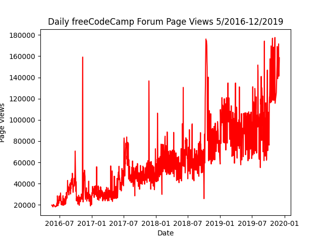
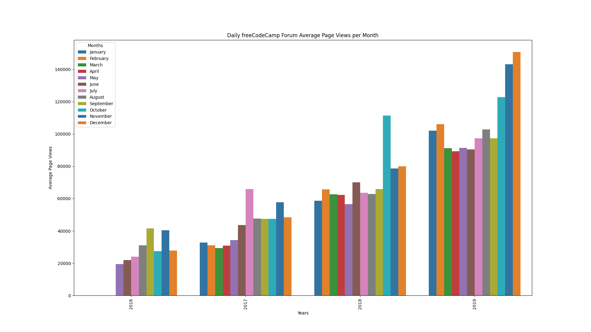
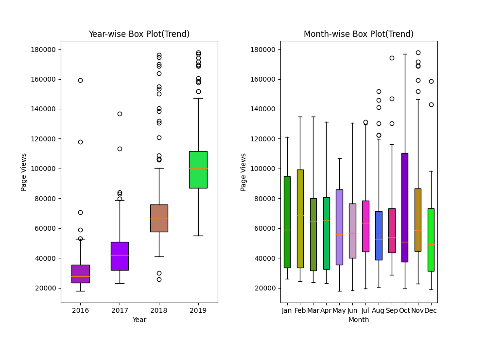

# Project: Time Series Data Visualization

This project is part of the **freeCodeCamp Data Analysis with Python** course. The goal is to visualize time series data using Pandas, Matplotlib, and Seaborn to better understand the patterns in daily page views of the freeCodeCamp.org forum. The data spans from **May 2016 to December 2019** and the visualizations focus on identifying trends and growth over the years and months.

## Project Overview

In this project, we work with a dataset containing the number of daily page views on the freeCodeCamp.org forum. Using various visualization techniques, the project helps identify patterns in visits and how they change over time.

### Key Visualizations:
1. **Line Plot**: Displays daily page views over time to highlight the overall trend.
2. **Bar Plot**: Displays the average daily page views grouped by month and year.
3. **Box Plots**: Shows the distribution of page views, revealing yearly trends and monthly seasonality.

## Requirements

The following libraries are required to run the project:
- **Pandas**: Data manipulation and cleaning.
- **Matplotlib**: Line plot and box plot creation.
- **Seaborn**: For enhanced visuals in the bar plot.
- **NumPy**: Random data generation for coloring the box plots.

You can install these libraries using pip:

```bash
pip install pandas matplotlib seaborn numpy
```

## Files
- **fcc-forum-pageviews.csv**: The dataset containing daily page views from 2016-05-09 to 2019-12-03.
- **line_plot.png**: Line chart displaying daily page views.
- **bar_plot.png**: Bar chart showing average daily page views per month, grouped by year.
- **boxplot.png**: Two adjacent box plots showing yearly trends and monthly seasonality.

## Code Overview

### Data Preprocessing
The dataset is cleaned by removing the top 2.5% and bottom 2.5% of page views to eliminate outliers. The `date` column is set as the index for easier manipulation and plotting.

### 1. Line Plot
The `draw_line_plot()` function generates a line plot showing daily page views over time. The plot has the following labels:
- **Title**: "Daily freeCodeCamp Forum Page Views 5/2016-12/2019"
- **X-axis**: "Date"
- **Y-axis**: "Page Views"

### 2. Bar Plot
The `draw_bar_plot()` function creates a bar chart, showing the average daily page views for each month grouped by year. The chart is designed as follows:
- **Title**: "Daily freeCodeCamp Forum Average Page Views per Month"
- **X-axis**: "Years"
- **Y-axis**: "Average Page Views"
- **Legend**: Months, color-coded for each month.

### 3. Box Plot
The `draw_box_plot()` function generates two box plots:
- **Year-wise Box Plot (Trend)**: Displays page view distribution per year.
- **Month-wise Box Plot (Seasonality)**: Shows the distribution of page views for each month across all years.
  
Each box plot is colored randomly to enhance visualization.

## How to Run
1. Clone this repository to your local machine.
2. Install the required libraries.
3. Place the dataset file (`fcc-forum-pageviews.csv`) in the same directory as the script.
4. Run the Python script to generate the visualizations:
```bash
python time_series_visualizer.py
```
5. The visualizations will be saved as `.png` files.

## Example Plots

- **Line Plot**  
  

- **Bar Plot**  
  

- **Box Plot**  
  

## Conclusion
This project is a comprehensive demonstration of time series data analysis and visualization. Through the use of Python libraries like Pandas, Matplotlib, and Seaborn, we can effectively clean and visualize complex datasets to extract meaningful insights.

